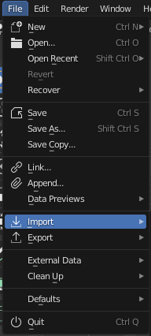
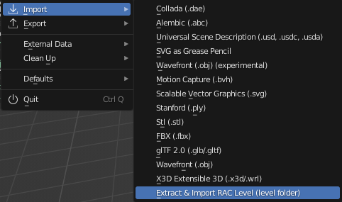
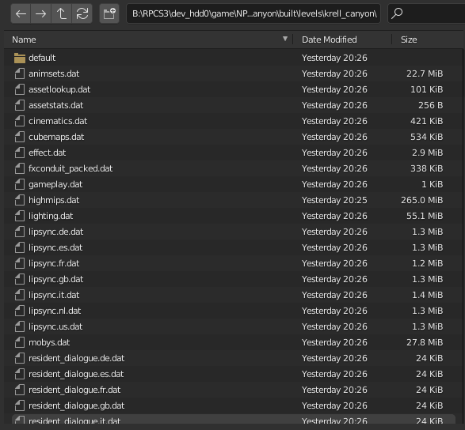
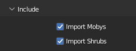

# Raclette & Tank Importer
Raclette And Tank Importer (RATI lol) is a Blender plugin that exports a map of Ratchet &amp; Clank from .dat files to Blender.

## SUPPORTED GAMES
List of the supported games (theorically):
- [ ] Ratchet & Clank: Tools of Destruction
- [ ] Ratchet & Clank: Quest For Booty
- [x] Ratchet & Clank: A Crack In Time
- [x] Ratchet & Clank: Full Frontal Assault (PS3 Version)
- [x] Ratchet & Clank: All 4 One
- [x] Ratchet & Clank: Into The Nexus
- [x] Resistance 2
- [x] Resistance 3

## How to use ?
### Step 1
Go to `USRDIR > packed > levels > LEVEL_NAME`, use PSArcTool or PS3GameExtractor and extract:
1. `level_cached.psarc` for the models and everything
2. `level_uncached.psarc` for the scripts *(not necessary but can help fangame developers)*

### Step 2
Open Blender.  
Click `Edit` in the topbar, then `⚙ Preferences`.
Go to `Add-ons` category, and search for `Raclette and Tank Importer` (it is in `Reverse-Engineering` category)  
Click the check mark to enable the plugin.

### Step 3
Click `File` in the topbar, then `📥 Import`.  
  
  
  
  
  
Press `Extract & Import RAC Assets (level folder)`.  
  
  
  

### Step 4
In the browser, search for your folder `USRDIR > packed > levels > LEVEL_NAME > built > levels > LEVEL_NAME` (depending on which game you want to export models)  
  
  
  
Check or uncheck options depending what you want to export and have on Blender. You can always import previously non-imported elements to the scene by redoing the [Step 3](#user-content-step-3). Do not forget to uncheck what you already imported to avoid duplicates.  
  
  
  
  
  

### Additional info
Each category of model (mobys, ties, shrubs, etc...) are splitted to different Collections.