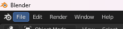

# Raclette & Tank Importer
Raclette And Tank Importer (RATI lol) is a Blender plugin that exports a map of Ratchet &amp; Clank from .dat files to Blender.

## SUPPORTED GAMES
List of the supported games (theorically):
- [ ] Ratchet & Clank: Tools of Destruction
- [ ] Ratchet & Clank: Quest For Booty
- [x] Ratchet & Clank: A Crack In Time
- [x] Ratchet & Clank: Full Frontal Assault (PS3 Version)
- [x] Ratchet & Clank: All 4 One
- [x] Ratchet & Clank: Into The Nexus
- [x] Resistance 2
- [x] Resistance 3

## SUPPORTED ELEMENTS
List of the supported elements:
- [x] Ties [^1]
- [ ] Mobys [^2]
- [ ] Shrubs [^3]
- [ ] UFrags [^4]
- [ ] Zones [^5]
- [ ] Textures [^6]

## How to use ?
### Step 1
Go to `USRDIR > packed > levels > LEVEL_NAME`, use PSArcTool or PS3GameExtractor and extract:
1. `level_cached.psarc` for the models and everything
2. `level_uncached.psarc` for the scripts *(not necessary but can help fangame developers)*

### Step 2
Open Blender.  
Click `Edit` in the topbar, then `⚙ Preferences`.
Go to `Add-ons` category, and search for `Raclette and Tank Importer` (it is in `Reverse-Engineering` category)  
Click the check mark to enable the plugin.

### Step 3
Click `File` in the topbar, then `📥 Import`.  
  
  
  
  
  
Press `Extract & Import RAC Assets (level folder)`.  
  
  
  

### Step 4
In the browser, search for your folder `USRDIR > packed > levels > LEVEL_NAME > built > levels > LEVEL_NAME` (depending on which game you want to export models)  
  
  
  
Check or uncheck options depending what you want to export and have on Blender. You can always import previously non-imported elements to the scene by redoing the [Step 3](#user-content-step-3). Do not forget to uncheck what you already imported to avoid duplicates.  
  
  
  
  
  

### Additional info
Each category of model (mobys, ties, shrubs, etc...) are splitted to different Collections.

# Will be moved to WIKI page

## Import settings
Importation settings of levels

### Category: Include
| Type      | Default | Supported |  Option Name  | Description                                                                                     |
|:----------|:-------:|:---------:|:-------------:|:------------------------------------------------------------------------------------------------|
| `Boolean` |    ❌    |     ❌     | Import Mobys  | Wether Mobys should import mobys or not                                                         |
| `Boolean` |    ✅    |     ❌     | Import Shrubs | Wether Shrubs should be imported or not.                                                        |
| `Boolean` |    ✅    |     ✅     |  Import Ties  | Wether Ties should be imported or not. It's recommended to not uncheck except for reimports |
| `Boolean` |    ✅    |     ❌     | Import UFrags | Wether UFrags should be imported or not. It's recommended to not uncheck this.              |
### Category: Settings
| Type      | Default | Supported |    Option Name     | Description                                                                                                                   |
|:----------|:-------:|:---------:|:------------------:|:------------------------------------------------------------------------------------------------------------------------------|
| `Boolean` |    ✅    |     ❌     |      Textures      | Wether textures should be extracted, imported and applied or not.                                                             |
| `Boolean` |    ❌    |     ❌     |     Lightning      | Wether light points should be extracted and imported or not.                                                                  |
| `Boolean` |    ❌    |     ❌     |       Zones        | Wether every mesh supported by zones should be put into its zone Creating subfolders in Blender.                          |
| `Boolean` |    ✅    |     ❌     | Create Collections | Wether a creation should be created for each mesh type (Mobys, Ties, Shrubs, UFrags) or everything should be put at root. |

[^1]: It's basically the greatest part of the terrain and walkable parts of maps.

[^2]: All the entities, so bolts, enemies, destructibles, crates, moving platforms, etc...

[^3]: All the map's mini-elements: Little stuff on walls, etc... Generally decorations

[^4]: If a part of the terrain is not a Tie, then it's UFrags. If unchecked, some maps may look very bad and incomplete

[^5]: It's used to group parts of the terrain and mobys in subfolders in Blender, iirc

[^6]: It seems obvious... But it's the textures. Of everything.